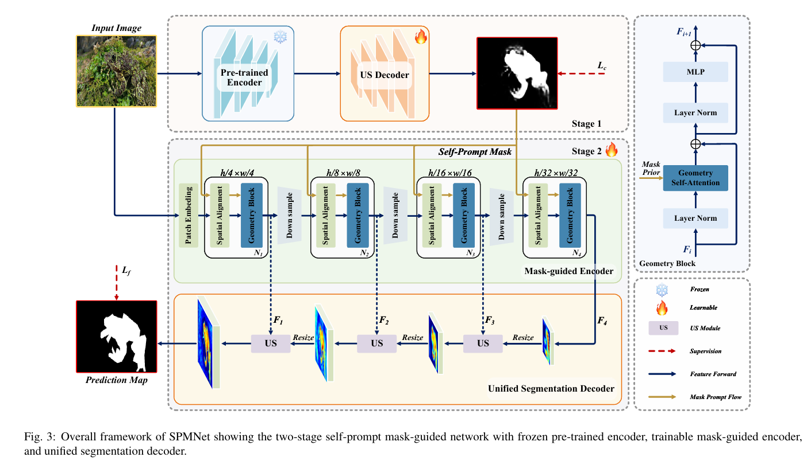
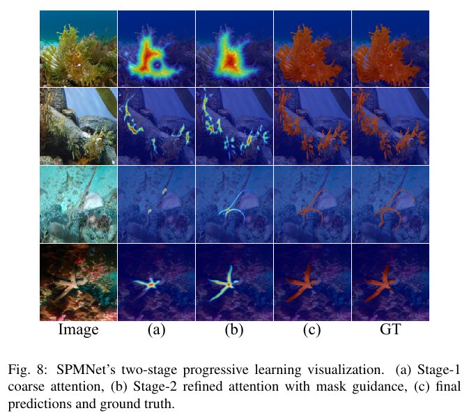
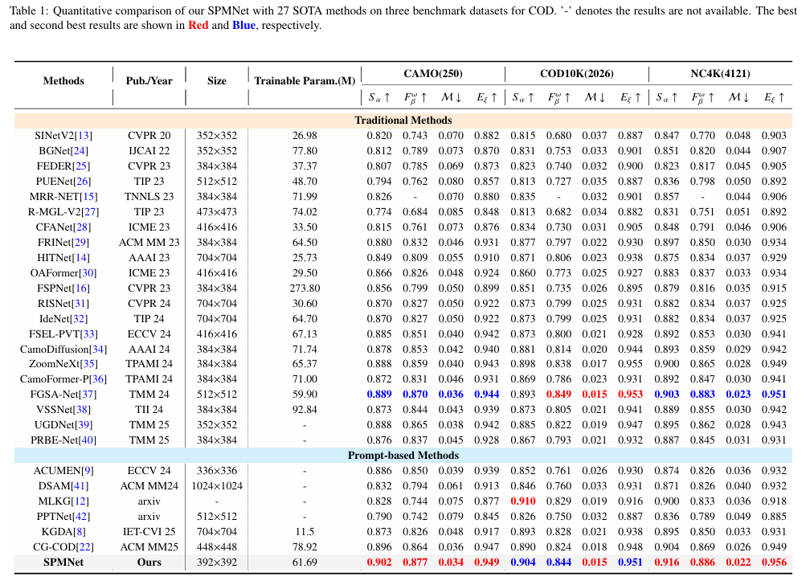

# SPMNet: Self-Prompt Mask-Guided Network for Camouflaged Object Detection
Authors: Bo Cai, Yanping Yang, Mengyin Wang, Jin Yan, Fenglin Li, Houjie Li*

Our work has been reviewed for KBS. The code has already been open sourced.

If you are interested in our work, please do not hesitate to contact us at 765499227@qq.com via email.



<!-- ## This paper is reviewed at ESWA  -->
## 🔆 News
[17.10.2025] We have released the code and model checkpoints for SPMNet !
## 🕳 Performance

## 🔧 Setup
<!-- ###### This is a Heading h6 -->

<!-- ## Runtime -->

<!-- *This text will be italic*  
_This will also be italic_

This text will be bold  
__This will also be bold__

_You can combine them_ -->
## 📖 Prepare Data
COD dataset can be found at [google drive](https://drive.google.com/file/d/1HPTKBZUgxj5E8SBcSTTIHDxpZJiavg4I/view?usp=drive_link).


## ⛓ Install Requirements

* Python 3.10.16
* torchvision 0.16.2


## 🪢 Training
Download the pre-trained weights [here](https://drive.google.com/drive/folders/1TjvD7dqqN4dUzSkpZBBq8e8Cfd6HDTKw?usp=sharing) and place them in the ./weight folder.
### Run
```
train.py
```
## 🧪 Evaluation
Download the SPMNet weights [here]().
### Run
```
test.py
```
## 🖼 Prediction maps
We provide the prediction maps of our SPMNet model COD Dataset [here](https://drive.google.com/drive/folders/1bMn98u-9kCJt2mvHsZQP_KSA0TQXhZgP?usp=sharing).

## 🗂 Citation
If you use CFF-KDNet method in your research or wish to refer to the baseline results published in the Model, please use the following BibTeX entry.
```

```
<!-- 
## Images


## Links

You may be using [Markdown Live Preview](https://markdownlivepreview.com/).

## Blockquotes

> Markdown is a lightweight markup language with plain-text-formatting syntax, created in 2004 by John Gruber with Aaron Swartz.
>
>> Markdown is often used to format readme files, for writing messages in online discussion forums, and to create rich text using a plain text editor.

 
## Blocks of code

```
let message = 'Hello world';
alert(message);
```

## Inline code

This web site is using `markedjs/marked`. -->
